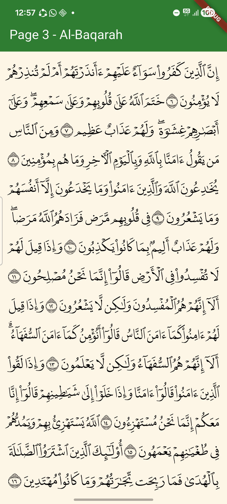

# arabic_text_justification

A Flutter FFI plugin for Arabic text justification using [HarfBuzz](https://harfbuzz.github.io/) for text shaping and [FreeType](https://freetype.org/) for glyph rasterization.

## Screenshot



## Features

- Arabic text rendering with correct RTL layout and ligature handling
- Dynamic justification via kashida stretching using DigitalKhatt's HarfBuzz justification branch
- HarfBuzz text shaping with FreeType glyph rasterization via FFI
- Word-level bounding boxes for hit-testing and highlighting
- Automatic line justification to fill available width
- Android and iOS support

## Usage

```dart
import 'package:arabic_text_justification/arabic_text_justification.dart';

// Render a line of Arabic text
final result = await ArabicTextJustification.renderLine(
  fontPath,       // path to .otf font file
  'بِسْمِ ٱللَّهِ ٱلرَّحْمَـٰنِ ٱلرَّحِيمِ',
  fontSize,       // font size in pixels
  availableWidth, // line width in pixels
);

// Display with RawImage
RawImage(
  image: result.image,
  fit: BoxFit.fill,
);

// Access word bounding boxes for hit-testing
for (final rect in result.wordRects) {
  print(rect.toRect());
}
```

## API

### `ArabicTextJustification.renderLine(fontPath, text, fontSize, availableWidth)`

Shapes and rasterizes text into an RGBA bitmap. Returns a `RenderResult` containing:
- `image` -- Flutter `ui.Image` ready for display
- `bmpWidth`, `bmpHeight` -- bitmap dimensions
- `wordRects` -- list of `WordRect` bounding boxes per word

### `ArabicTextJustification.shapeLine(fontPath, text, fontSize, availableWidth)`

Shapes text without rasterizing. Returns a `ShapeResult` containing:
- `glyphs` -- list of `GlyphInfo` with glyph IDs, offsets, and advances
- `totalWidth` -- total shaped line width

## Project Structure

```
lib/    Dart FFI bindings and public API
src/    C++ native code (HarfBuzz + FreeType integration)
```

## Acknowledgments

- [DigitalKhatt](https://digitalkhatt.org/) -- Arabic justification and font technology
- [HarfBuzz](https://harfbuzz.github.io/) -- Text shaping engine (justification branch by DigitalKhatt)
- [FreeType](https://freetype.org/) -- Font rendering library

Portions of this software are copyright (c) 2023 The FreeType Project (https://freetype.org). All rights reserved.

See [THIRD_PARTY_NOTICES](THIRD_PARTY_NOTICES) for full license details.

## License

MIT -- see [LICENSE](LICENSE) for details.
